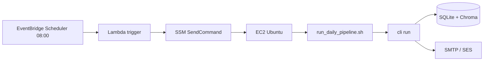

# AWS Deployment Agent — EventBridge + EC2 (raz dziennie, free tier)

**Branch:** `cursor/aws-daily-cron-503f`  
**Pliki:** `infra/aws/*`, `docs/agents/aws-deployment-agent.md`

---

## Cel

Uruchomić **cały pipeline** (scrape → match → email) **raz na dobę** przez **EventBridge Scheduler** — bez crona na serwerze.

```
EventBridge Scheduler (8:00 PL)
    → Lambda (darmowe, 1×/dzień)
        → SSM Run Command (darmowe)
            → EC2: run_daily_pipeline.sh
                → cli run + NOTIFIER
```

Harmonogram jest po stronie **AWS (EventBridge)**, nie w kodzie aplikacji.

---

## Koszty (free tier — ~0 zł)

| Usługa | Wywołania | Free tier |
|--------|-----------|-----------|
| **EventBridge Scheduler** | 1×/dzień | 14 mln/mies. — **$0** |
| **Lambda** | 1×/dzień | 1 mln/mies. — **$0** |
| **SSM Run Command** | 1×/dzień | standard — **$0** |
| **EC2 t3.micro** | 24/7 | 750 h/mies. przez 12 mies. — **$0** |
| **SES** (email) | kilka/dzień | 62k/mies. z EC2 — **$0** |
| **CloudWatch Logs** | mało | 5 GB/mies. — **$0** |

> Po 12 miesiącach EC2 może kosztować ~8 USD/mies. — wtedy rozważ zatrzymywanie instancji poza runem (zaawansowane).

---

## Dlaczego EventBridge, a nie cron?

| | EventBridge + Lambda + SSM | cron na EC2 |
|--|---------------------------|-------------|
| Harmonogram w AWS Console | tak | nie (SSH + crontab) |
| Free tier | tak | tak |
| EC2 musi działać 24/7 | tak (na MVP) | tak |
| Zalecane | **tak** | zapasowe |

---

## Architektura



---

## Krok 1 — Konto AWS

1. Konto na [https://aws.amazon.com](https://aws.amazon.com)
2. MFA na użytkowniku IAM
3. Lokalnie: `aws configure` (Access Key + region `eu-central-1`)

---

## Krok 2 — EC2 z rolą SSM (free tier)

1. **EC2** → **Launch instance**
2. Ustawienia:
   - **Name:** `job-search`
   - **AMI:** Ubuntu 22.04 LTS
   - **Type:** `t3.micro` (Free tier)
   - **Key pair:** `.pem` do SSH
   - **IAM instance profile:** utwórz rolę z policy **`AmazonSSMManagedInstanceCore`**
     - EC2 → Launch → Advanced → IAM instance profile → Create new role → SSM → `AmazonSSMManagedInstanceCore`
3. **Security group:** SSH (22) tylko z Twojego IP
4. **Storage:** 20–30 GB
5. Launch → zapisz **Instance ID** (`i-0abc123...`)

Sprawdź SSM (z laptopa, po 2–5 min):

```bash
aws ssm describe-instance-information \
  --query 'InstanceInformationList[?PingStatus==`Online`].[InstanceId,ComputerName]' \
  --output table
```

Instancja musi być **Online** w SSM.

---

## Krok 3 — Instalacja aplikacji na EC2

```bash
ssh -i job-search.pem ubuntu@<EC2_IP>

git clone https://github.com/Maxifunny/Job_search.git
cd Job_search
cp infra/aws/env.ec2.example .env
nano .env   # LLM_API_KEY, SMTP, NOTIFIER_SECRET, NOTIFIER_ENABLED=true

chmod +x infra/aws/install_ec2.sh infra/aws/run_daily_pipeline.sh
./infra/aws/install_ec2.sh

# Test ręczny na EC2:
./infra/aws/run_daily_pipeline.sh
tail -50 logs/latest.log
```

---

## Krok 4 — EventBridge Scheduler (raz dziennie)

**Na laptopie** (nie na EC2), z AWS CLI:

```bash
cd Job_search   # lokalna kopia repo

export AWS_REGION=eu-central-1
export EC2_INSTANCE_ID=i-0123456789abcdef0   # Twoje Instance ID
export RUN_AS_USER=ubuntu
export PIPELINE_SCRIPT=/home/ubuntu/Job_search/infra/aws/run_daily_pipeline.sh
export SCHEDULE_HOUR=8                        # 8:00 rano
export SCHEDULE_TIMEZONE=Europe/Warsaw

chmod +x infra/aws/setup_eventbridge.sh
./infra/aws/setup_eventbridge.sh
```

Skrypt tworzy:
- Lambda `job-search-daily-trigger`
- EventBridge Scheduler `job-search-daily` — **cron raz dziennie**
- role IAM (Lambda → SSM, Scheduler → Lambda)

### Test harmonogramu (bez czekania do 8:00)

```bash
aws lambda invoke \
  --function-name job-search-daily-trigger \
  --region eu-central-1 \
  /tmp/job-search-out.json

cat /tmp/job-search-out.json
```

Na EC2 po ~1–2 min:

```bash
tail -100 ~/Job_search/logs/latest.log
```

### Podgląd w konsoli AWS

- **EventBridge** → **Schedules** → `job-search-daily`
- **Lambda** → `job-search-daily-trigger` → Monitor → Logs
- **Systems Manager** → **Run Command** → historia

---

## Krok 5 — Konfiguracja `.env` na EC2

```env
NOTIFIER_ENABLED=true
NOTIFIER_MAX_OFFERS=10
NOTIFIER_SECRET=losowy-sekret

LLM_API_KEY=AIza...
LLM_FALLBACK_MODELS=gemini-2.0-flash,gemini-1.5-flash

JOB_SEARCH_SECTOR=data
JOB_SEARCH_SOURCE=justjoin
JOB_SEARCH_MAX_OFFERS=30
JOB_SEARCH_MATCH_LIMIT=20

SMTP_HOST=...
SMTP_FROM=...
SMTP_TO=...
```

---

## Krok 6 — Amazon SES (email, free tier)

1. **SES** → region `eu-central-1`
2. Zweryfikuj email nadawcy i odbiorcy (sandbox)
3. **SMTP credentials** → wklej do `.env` na EC2

```env
SMTP_HOST=email-smtp.eu-central-1.amazonaws.com
SMTP_PORT=587
SMTP_USER=...
SMTP_PASSWORD=...
```

---

## Krok 7 — CloudWatch (opcjonalnie)

- Logi Lambda: automatycznie w `/aws/lambda/job-search-daily-trigger`
- Logi pipeline: `~/Job_search/logs/latest.log` na EC2
- Możesz dołożyć CloudWatch Agent na EC2 (free tier 5 GB)

---

## Alternatywa: cron (bez EventBridge)

Tylko jeśli nie chcesz Lambda/SSM:

```bash
crontab -e
# wklej infra/aws/crontab.example
```

---

## Rozwiązywanie problemów

| Problem | Rozwiązanie |
|---------|-------------|
| SSM Offline | IAM role `AmazonSSMManagedInstanceCore` na EC2, SSM agent |
| Lambda błąd AccessDenied | Ponów `setup_eventbridge.sh`, sprawdź role IAM |
| Pipeline nie startuje | `aws ssm list-command-invocations --instance-id i-...` |
| Brak maila | `NOTIFIER_ENABLED=true`, SMTP w `.env` |
| Dwa maile/dzień | Jeden harmonogram EventBridge; nie używaj cron + EventBridge razem |

---

## Pliki w repozytorium

| Plik | Opis |
|------|------|
| `infra/aws/setup_eventbridge.sh` | **Główny setup** harmonogramu |
| `infra/aws/lambda/trigger_daily_pipeline.py` | Lambda → SSM |
| `infra/aws/run_daily_pipeline.sh` | Pipeline na EC2 |
| `infra/aws/install_ec2.sh` | Instalacja na EC2 |
| `infra/aws/env.ec2.example` | Szablon `.env` |
| `infra/aws/crontab.example` | Zapasowy cron |

---

## Definition of Done

- [x] EventBridge Scheduler — raz dziennie
- [x] Lambda + SSM (free tier)
- [x] Skrypt `setup_eventbridge.sh`
- [x] Dokumentacja krok po kroku
- [x] Cron jako alternatywa
