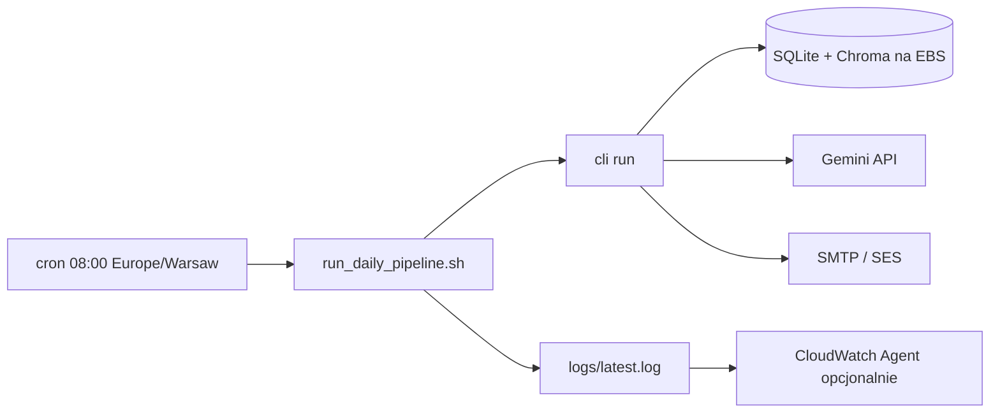

# AWS Deployment Agent — EC2 + cron raz dziennie

**Branch:** `cursor/aws-daily-cron-503f`  
**Pliki:** `infra/aws/*`, `docs/agents/aws-deployment-agent.md`

---

## Cel

Uruchomić **cały pipeline** (scrape → match → email) na AWS **raz na dobę** przez **cron na EC2**.

Harmonogram jest po stronie **infrastruktury** (cron), nie w kodzie aplikacji. Jeśli uruchomisz `run` ręcznie drugi raz tego samego dnia, mail może pójść ponownie — w produkcji używaj wyłącznie cron.

---

## Dlaczego EC2, a nie Lambda?

| Opcja | Werdykt |
|-------|---------|
| **EC2 + cron** | Najprostsze: SQLite, Chroma, scraping, ten sam kod co lokalnie |
| Lambda | Zły fit: timeout, brak trwałego dysku, ciężki deployment |
| ECS | Za wcześnie na jednego użytkownika |

---

## Architektura (free tier)



---

## Krok 1 — Konto AWS

1. Załóż konto na [https://aws.amazon.com](https://aws.amazon.com)
2. Włącz **MFA** na root / użytkowniku IAM
3. Utwórz użytkownika IAM z programowym dostępem (do SSH użyjesz klucza EC2, nie IAM API na start)

---

## Krok 2 — Uruchom instancję EC2 (free tier)

1. Konsola AWS → **EC2** → **Launch instance**
2. Ustawienia:
   - **Name:** `job-search`
   - **AMI:** Ubuntu Server 22.04 LTS (lub Amazon Linux 2023)
   - **Instance type:** `t3.micro` lub `t2.micro` (Free tier eligible)
   - **Key pair:** utwórz i pobierz `.pem`
   - **Storage:** 20–30 GB gp3 (Free tier: 30 GB)
3. **Security group:**
   - SSH (22) — tylko **Twój IP** (nie 0.0.0.0/0 na stałe)
   - Brak portu 8501 publicznie (UI na razie lokalnie / SSH tunnel)
4. Launch

---

## Krok 3 — Połączenie SSH

```bash
chmod 400 job-search.pem
ssh -i job-search.pem ubuntu@<PUBLIC_IP_EC2>
```

Amazon Linux: użytkownik `ec2-user`.

---

## Krok 4 — Klon repozytorium

```bash
sudo apt-get update && sudo apt-get install -y git
git clone https://github.com/Maxifunny/Job_search.git
cd Job_search
git checkout cursor/aws-daily-cron-503f   # lub main po merge PR
```

---

## Krok 5 — Instalacja aplikacji

```bash
chmod +x infra/aws/install_ec2.sh infra/aws/run_daily_pipeline.sh
cp infra/aws/env.ec2.example .env
nano .env   # LLM_API_KEY, SMTP, NOTIFIER_SECRET
./infra/aws/install_ec2.sh
```

---

## Krok 6 — Konfiguracja `.env` na EC2

Wymagane minimum:

```env
LLM_API_KEY=AIza...
NOTIFIER_ENABLED=true
NOTIFIER_SECRET=losowy-sekret-16-znakow
SMTP_HOST=...
SMTP_FROM=...
SMTP_TO=...
```

Parametry dziennego runu (opcjonalne):

```env
JOB_SEARCH_SECTOR=data
JOB_SEARCH_SOURCE=justjoin
JOB_SEARCH_MAX_OFFERS=30
JOB_SEARCH_MATCH_LIMIT=20
```

---

## Krok 7 — Cron: RAZ NA DZIEN (najważniejsze)

```bash
crontab -e
```

Wklej z `infra/aws/crontab.example` (popraw ścieżkę):

```cron
CRON_TZ=Europe/Warsaw
0 8 * * * /home/ubuntu/Job_search/infra/aws/run_daily_pipeline.sh
```

To uruchamia **całość raz dziennie o 8:00** czasu polskiego.

Sprawdź:

```bash
crontab -l
```

**Nie dodawaj** drugiego wpisu ani częstszego harmonogramu — jeden wpis = jeden mail/dzień (przy `NOTIFIER_ENABLED=true`).

---

## Krok 8 — Test ręczny (przed cron)

```bash
cd ~/Job_search
./infra/aws/run_daily_pipeline.sh
tail -100 logs/latest.log
```

Oczekiwany koniec logu:

```
[pipeline] Email wysłany: N ofert → twoj@email.com
[pipeline] Krok 3/3: Gotowe.
```

---

## Krok 9 — Amazon SES (email produkcyjny, free tier)

1. AWS Console → **SES** → region np. **eu-central-1** (Frankfurt)
2. **Verified identities** → zweryfikuj domenę lub adres email (na start: swój Gmail jako `SMTP_TO` + zweryfikowany `SMTP_FROM`)
3. **SMTP settings** → **Create SMTP credentials**
4. W `.env`:

```env
SMTP_HOST=email-smtp.eu-central-1.amazonaws.com
SMTP_PORT=587
SMTP_USER=<SMTP username z SES>
SMTP_PASSWORD=<SMTP password z SES>
SMTP_FROM=zweryfikowany@email.pl
SMTP_TO=twoj-email@gmail.com
```

Sandbox SES: możesz wysyłać tylko na zweryfikowane adresy — na start wystarczy.

---

## Krok 10 — CloudWatch Logs (opcjonalnie)

1. EC2 → **CloudWatch agent** — zainstaluj na instancji
2. Skonfiguruj zbieranie pliku:

```
/home/ubuntu/Job_search/logs/latest.log
```

3. W konsoli CloudWatch → **Log groups** → podgląd błędów pipeline

Free tier: 5 GB ingestion / miesiąc — wystarczy na logi dzienne.

---

## Krok 11 — Aktualizacja kodu na serwerze

```bash
cd ~/Job_search
git pull origin main
source .venv/bin/activate
pip install -e .
python -m job_search.cli migrate
```

Cron zostaje bez zmian.

---

## Rozwiązywanie problemów

| Problem | Rozwiązanie |
|---------|-------------|
| Cron nie działa | `grep CRON /var/log/syslog` (Ubuntu), sprawdź ścieżkę w crontab |
| Brak maila | `NOTIFIER_ENABLED=true`, sprawdź SMTP w `.env`, `tail logs/latest.log` |
| 503 Gemini | `LLM_FALLBACK_MODELS` w `.env` |
| Permission denied | `chmod +x infra/aws/run_daily_pipeline.sh` |
| Dwa maile dziennie | Usuń duplikaty w `crontab -l` — zostaw **jeden** wpis |

---

## Pliki w repozytorium

| Plik | Opis |
|------|------|
| `infra/aws/run_daily_pipeline.sh` | Wrapper: migrate + `cli run` + logi |
| `infra/aws/install_ec2.sh` | venv, pip, init-db, migrate |
| `infra/aws/crontab.example` | **1× dziennie** o 8:00 |
| `infra/aws/env.ec2.example` | Szablon `.env` pod EC2 |

---

## Definition of Done

- [x] Skrypty instalacji i dziennego runu
- [x] Crontab example — jeden run na dobę
- [x] Dokumentacja krok po kroku
- [x] SES / CloudWatch opisane
- [ ] Terraform/CDK — poza zakresem MVP
