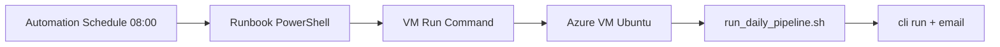

# Azure Deployment Agent — VM + Automation (raz dziennie, free tier)

**Branch:** `cursor/azure-daily-schedule-503f`  
**Pliki:** `infra/azure/*`, `docs/agents/azure-deployment-agent.md`

> **Decyzja projektu:** wdrożenie produkcyjne na **Azure** (nie AWS).  
> AWS: [aws-deployment-agent.md](aws-deployment-agent.md) — archiwum / niezalecane.

---

## Cel

Uruchomić **cały pipeline** (scrape → match → email) **raz na dobę** na Azure — prościej niż AWS (bez Lambda + SSM + EventBridge + skomplikowanego IAM).

```
Azure Automation (harmonogram 8:00)
    → Runbook PowerShell
        → Run Command na VM
            → run_daily_pipeline.sh
                → cli run + NOTIFIER
```

---

## Koszty (free tier — ~0 zł przez 12 mies.)

| Usługa | Free tier |
|--------|-----------|
| **VM B1s** (Linux) | 750 h/mies. przez 12 mies. |
| **Azure Automation** | 500 min runbooków/mies. |
| **Run Command** | wliczone w VM |
| **Gmail SMTP** | darmowe (testy) |

> Po 12 mies.: VM B1s ~10 EUR/mies. — nadal najtańsza opcja.

---

## Dlaczego Azure zamiast AWS?

| | Azure | AWS (poprzednio) |
|--|-------|------------------|
| Harmonogram | Automation / Logic Apps | EventBridge + Lambda + SSM |
| IAM / role | 1 rola VM Contributor | 3+ role, uprawnienia Lambda |
| Setup | 1 skrypt PowerShell | `setup_eventbridge.sh` + SSM Online |
| Portal | polski interfejs | — |

---

## Architektura



---

## Krok 1 — Konto Azure

1. [https://azure.microsoft.com/free/](https://azure.microsoft.com/free/) — konto + 200 USD kredytu na 30 dni
2. Zainstaluj lokalnie:
   - [Azure CLI](https://learn.microsoft.com/cli/azure/install-azure-cli)
   - PowerShell moduł Az: `Install-Module Az -Scope CurrentUser`
3. Logowanie:

```powershell
Connect-AzAccount
# wybierz subskrypcję:
Get-AzSubscription | Set-AzContext
```

---

## Krok 2 — Utwórz VM (portal — najprościej)

1. Portal Azure → **Utwórz zasób** → **Maszyna wirtualna**
2. Ustawienia:
   - **RG:** `job-search-rg`
   - **Nazwa:** `job-search-vm`
   - **Region:** **West Europe** (Polska blisko)
   - **Obraz:** Ubuntu Server 22.04 LTS
   - **Rozmiar:** `Standard_B1s` (Free tier eligible)
   - **Uwierzytelnianie:** klucz SSH publiczny
   - **Publiczny IP:** tak (na start, do SSH)
3. **Sieć:** NSG — SSH (22) tylko z Twojego IP
4. Utwórz

Zapisz **publiczny IP**.

---

## Krok 3 — Instalacja aplikacji na VM

```bash
ssh azureuser@<PUBLIC_IP>

git clone https://github.com/Maxifunny/Job_search.git
cd Job_search
cp infra/azure/env.vm.example .env
nano .env   # LLM_API_KEY, SMTP, NOTIFIER_ENABLED=true, NOTIFIER_SECRET

chmod +x infra/azure/install_vm.sh infra/azure/run_daily_pipeline.sh
./infra/azure/install_vm.sh

# Test:
./infra/azure/run_daily_pipeline.sh
tail -50 logs/latest.log
```

---

## Krok 4 — Harmonogram raz dziennie (Automation)

**Na laptopie (Windows PowerShell):**

```powershell
cd C:\ścieżka\do\Job_search
Connect-AzAccount

./infra/azure/Setup-DailySchedule.ps1 `
  -ResourceGroupName job-search-rg `
  -VMName job-search-vm `
  -ScheduleHour 8
```

Skrypt tworzy:
- Automation Account `job-search-automation`
- Runbook `Invoke-JobSearchDaily`
- Harmonogram `job-search-daily` — **1× na dobę o 8:00**

### Test runbook (portal)

1. Azure Portal → **Automation Accounts** → `job-search-automation`
2. **Runbooks** → `Invoke-JobSearchDaily` → **Start**
3. Parametry: `ResourceGroupName`, `VMName`
4. Na VM: `tail -100 ~/Job_search/logs/latest.log`

---

## Krok 5 — Alternatywa: Logic Apps (klikane w portalu)

Jeśli wolisz wizualny edytor zamiast PowerShell:

1. Portal → **Logic Apps** → **Consumption** → Utwórz
2. **Wyzwalacz:** Recurrence — co 1 dzień, godz. 8:00, strefa `(UTC+01:00) Warsaw`
3. **Akcja:** Szukaj **Azure VM** → **Run shell script on Linux VM**
   - Subskrypcja, RG, VM
   - Script: `/home/azureuser/Job_search/infra/azure/run_daily_pipeline.sh`
4. Zapisz

Free tier Logic Apps: 4000 akcji/mies. — wystarczy.

---

## Krok 6 — Email (notifier)

W `.env` na VM:

```env
NOTIFIER_ENABLED=true
NOTIFIER_MAX_OFFERS=10
NOTIFIER_SECRET=losowy-sekret

SMTP_HOST=smtp.gmail.com
SMTP_USER=twoj@gmail.com
SMTP_PASSWORD=haslo-aplikacji
SMTP_FROM=twoj@gmail.com
SMTP_TO=twoj@gmail.com
```

Gmail: [hasło aplikacji](https://myaccount.google.com/apppasswords).

---

## Krok 7 — `.env` — parametry pipeline

```env
LLM_API_KEY=AIza...
JOB_SEARCH_SECTOR=data
JOB_SEARCH_SOURCE=justjoin
JOB_SEARCH_MAX_OFFERS=30
JOB_SEARCH_MATCH_LIMIT=20
```

---

## Zapasowo: cron na VM

```bash
crontab -e
# wklej infra/azure/crontab.example
```

Używaj **albo** Automation **albo** cron — nie obu naraz.

---

## Rozwiązywanie problemów

| Problem | Rozwiązanie |
|---------|-------------|
| Runbook Access Denied | Ponów `Setup-DailySchedule.ps1` (rola VM Contributor) |
| VM nie odpowiada | Sprawdź czy VM jest uruchomiona (Running) |
| Brak maila | `NOTIFIER_ENABLED=true`, SMTP w `.env` |
| 503 Gemini | `LLM_FALLBACK_MODELS` w `.env` |
| Dwa maile/dzień | Jeden harmonogram (Automation LUB cron) |

---

## Pliki

| Plik | Opis |
|------|------|
| `infra/azure/install_vm.sh` | Instalacja na VM |
| `infra/azure/run_daily_pipeline.sh` | Dzienny pipeline |
| `infra/azure/Setup-DailySchedule.ps1` | **Harmonogram Automation** |
| `infra/azure/runbook/Invoke-DailyPipeline.ps1` | Runbook |
| `infra/azure/env.vm.example` | Szablon `.env` |
| `infra/azure/crontab.example` | Zapasowy cron |

---

## Aktualizacja kodu na VM

```bash
cd ~/Job_search
git pull origin main
source .venv/bin/activate
pip install -e .
python -m job_search.cli migrate
```

Harmonogram zostaje bez zmian.
