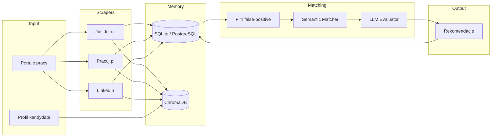
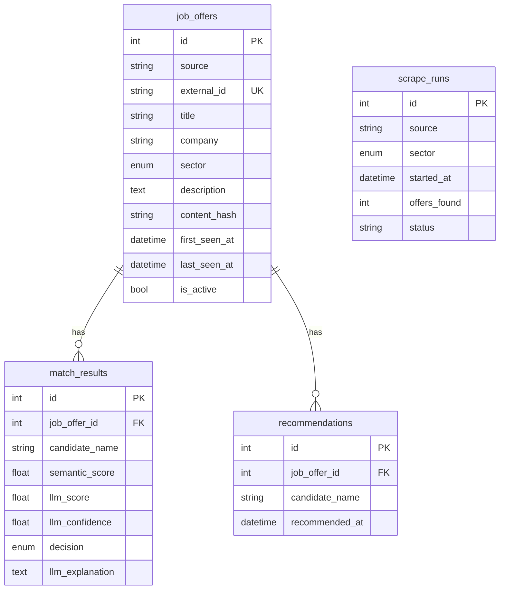

# Architektura systemu — Job Search

## 1. Przegląd

System autonomicznie wyszukuje oferty pracy w sektorach **Data** i **Automatyka**, zapisuje je w pamięci relacyjnej i wektorowej, a następnie dopasowuje je do profilu kandydata przy użyciu analizy semantycznej i LLM.



## 2. Stack technologiczny

| Warstwa | Technologia | Uzasadnienie |
|---------|-------------|--------------|
| Język | Python 3.11+ | Ekosystem ML/scraping, łatwa modularność |
| ORM / DB | SQLAlchemy 2 + SQLite (dev) / PostgreSQL (prod) | Trwała pamięć ofert, deduplikacja, audyt |
| Vector DB | ChromaDB (persistent) | Semantyczne dopasowanie umiejętności |
| LLM | OpenAI-compatible API | Ocena dopasowania ról i umiejętności |
| Embeddings | text-embedding-3-small | Niskie koszty, dobra jakość |
| Scraping | httpx + BeautifulSoup (+ Selenium opcjonalnie) | API + HTML parsing |
| Config | pydantic-settings | Typowane zmienne środowiskowe |
| Migracje | Alembic | Ewolucja schematu DB |
| Testy | pytest | Jednostkowe testy modułów |

## 3. Struktura katalogów

```
Job_search/
├── config/                     # Ustawienia aplikacji
│   └── settings.py
├── docs/
│   ├── architecture.md         # Ten dokument
│   └── agents/                 # Taski dla subagentów
├── migrations/                 # Alembic
├── scripts/
│   └── init_db.py              # Bootstrap DB + ChromaDB
├── src/job_search/
│   ├── cli.py                  # Punkt wejścia CLI
│   ├── memory/                 # Agent: Repo/Data
│   │   ├── models.py           # Schemat ORM
│   │   ├── database.py
│   │   ├── repositories.py
│   │   └── vector_store.py
│   ├── scrapers/               # Agent: Scraper
│   │   ├── base.py
│   │   └── sources/
│   ├── matching/               # Agent: Matching
│   │   ├── filters.py
│   │   ├── semantic_matcher.py
│   │   ├── llm_evaluator.py
│   │   └── engine.py
│   ├── orchestrator/           # Master Agent
│   │   └── pipeline.py
│   └── schemas/                # Wspólne modele Pydantic
├── tests/
├── .env.example
├── pyproject.toml
└── requirements.txt
```

## 4. Schemat bazy danych (Memory)

### 4.1 Pamięć krótkoterminowa (operacyjna)

| Tabela | Rola |
|--------|------|
| `scrape_runs` | Log każdego uruchomienia scrapera (status, liczba ofert) |

### 4.2 Pamięć długoterminowa (relacyjna)

| Tabela | Rola | Klucz deduplikacji |
|--------|------|-------------------|
| `job_offers` | Kanoniczny rejestr ofert | `(source, external_id)` + `content_hash` |
| `match_results` | Wyniki oceny LLM/semantic | `(job_offer_id, candidate_name)` |
| `recommendations` | Oferty już polecone użytkownikowi | `(job_offer_id, candidate_name)` |
| `user_preferences` | Profil kandydata (JSON) | `candidate_name` |

### 4.3 Pamięć semantyczna (wektorowa — ChromaDB)

| Kolekcja | Zawartość | ID dokumentu |
|----------|-----------|--------------|
| `job_offers` | Embedding opisu + wymagań oferty | `{source}:{external_id}` |
| `user_preferences` | Embedding CV + umiejętności | `candidate_name` |

### 4.4 Diagram ER



## 5. Przepływ dopasowania (Matching Pipeline)

1. **Scrape** — pobranie surowych ofert z portali.
2. **Upsert** — zapis w `job_offers` + embedding w ChromaDB.
3. **Deduplikacja rekomendacji** — sprawdzenie tabeli `recommendations`.
4. **Filtr false-positive** — odrzucenie np. „Data Entry” dla profilu Data Scientist.
5. **Semantic score** — cosine similarity profil ↔ oferta (próg: `MIN_SEMANTIC_SCORE`).
6. **LLM evaluation** — ocena pokrycia umiejętności (próg: `MIN_LLM_CONFIDENCE`).
7. **Recommend** — zapis w `recommendations`, aby nie polecać ponownie.

## 6. Konwencje GitHub (modularność zespołu)

| Moduł | Branch prefix | Owner |
|-------|---------------|-------|
| `memory/` | `feature/memory-*` | Repo/Data Agent |
| `scrapers/` | `feature/scraper-*` | Scraper Agent |
| `matching/` | `feature/matching-*` | Matching Agent |
| `orchestrator/` | `feature/pipeline-*` | Master Agent |

Każdy PR musi zawierać testy jednostkowe dla nowej logiki i aktualizację `.env.example` jeśli dodaje nowe zmienne.

## 7. Sektory i role docelowe

### Data (`sector=data`)
- Data Analyst
- Data Engineer
- Data Scientist

### Automatyka (`sector=automation`)
- Automatyk
- Programista PLC
- Automation Engineer

## 8. Następne kroki (Krok 2+)

1. Repo/Data Agent — dokończenie repozytoriów, testy integracyjne ChromaDB.
2. Scraper Agent — implementacja JustJoin.it (API), potem Pracuj.pl.
3. Matching Agent — embeddingi + prompt LLM + testy false-positive.
4. Master Agent — `JobSearchPipeline.run()` łączący wszystkie moduły.
